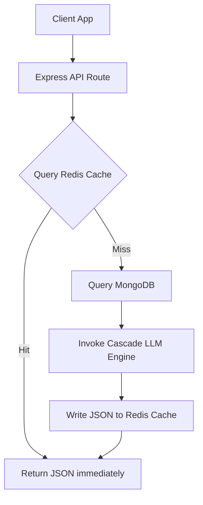

# 📊 SalesPulse

SalesPulse is a production-grade, AI-driven Salesforce CRM analytics and strategy execution portal. It bridges enterprise Salesforce CRM data with cutting-edge Large Language Models (Google Gemini & DeepSeek) to generate actionable insights, risk assessments, and next-step recommendations. The platform also features an interactive visual flowchart builder powered by React Flow for mapping out account closing strategies.

---

## 📖 Project Description

SalesPulse acts as an intelligence layer on top of standard CRM systems. While Salesforce is excellent at recording transactions, accounts, and contact histories, sales representatives often struggle to synthesize lengthy email threads, identify hidden deal risks, or coordinate consistent strategies. 

SalesPulse solves this by:
1. **Aggregating and transforming** Salesforce relational tables into a flexible document model.
2. **Applying context-aware LLMs** to extract key customer needs, risk factors, next steps, and deal-winning strategies.
3. **Visualizing strategy paths** using flowcharts, allowing reps to drag, drop, and configure custom deal navigation flows with conditional checks (e.g., procurement approval, technical verification).

---

## 🔄 The Data Sync Pipeline (CRM ➔ MongoDB)

```mermaid
sequenceDiagram
    participant SF as Salesforce CRM
    participant API as Ingestion Route (NodeJS)
    participant DB as MongoDB
    
    rect rgb(30, 41, 59)
    note right of API: OAuth2 with PKCE Flow
    API->>SF: Redirect User (Challenge S256)
    SF->>API: Return Auth Code
    API->>SF: Exchange Code for Access Token
    end
    
    rect rgb(15, 23, 42)
    note right of API: Background ETL Sync Execution
    API->>SF: Run queries (SOQL) for Users, Accounts, Contacts, Opportunities, Events, Emails
    SF->>API: Return records (Auto-paginated)
    API->>API: Transform relational schema to strict Mongo objects
    API->>DB: Bulk Upsert into collections ($set, upsert: true)
    API->>DB: Write last sync metadata to sync_meta
    end
```



### 1. Ingestion Protocol
* **Authentication**: Supports standard **OAuth2 Web Server Flow with PKCE** (`S256` code challenge). The server redirects to Salesforce login, captures the authorization callback code, exchanges it for an `access_token`, and kicks off an asynchronous background sync thread.
* **Fallback Authentication**: Standard username-password auth utilizing a combination of `SF_PASSWORD` + `SF_SECURITY_TOKEN` (enabled via Connected App settings).

### 2. Schema Transformation
Salesforce relational tables are mapped to Mongo documents as follows:

| Salesforce Object | MongoDB Collection | Transform Details / Mapping |
|---|---|---|
| `User` | `users` | `Id` ➔ `ID`, `Name` ➔ `NAME`, `Username` ➔ `USERNAME`, `Email` ➔ `EMAIL` |
| `Account` | `accounts` | `Id` ➔ `ID`, `Name` ➔ `NAME`, `Type` ➔ `TYPE`, `Website` ➔ `WEBSITE`, `Industry` ➔ `INDUSTRY`, `OwnerId` ➔ `OWNER_ID` |
| `Contact` | `contacts` | `Id` ➔ `ID`, `AccountId` ➔ `ACCOUNT_ID`, `FirstName`/`LastName` ➔ `FIRST_NAME`/`LAST_NAME`, `Email`/`Phone`/`Title` |
| `Opportunity` | `opportunities` | `Id` ➔ `ID`, `Name` ➔ `NAME`, `StageName` ➔ `STAGE_NAME`, `Amount` ➔ `AMOUNT`, `CloseDate` ➔ `CLOSE_DATE`, `IsClosed` ➔ `IS_CLOSED` (1/0), `IsWon` ➔ `IS_WON` (1/0) |
| `Event` | `events` | `Id` ➔ `ID`, `WhatId`/`AccountId` ➔ `ACCOUNT_ID`, `Subject` ➔ `SUBJECT`, `StartDateTime`/`EndDateTime` ➔ `START_DATE_TIME`/`END_DATE_TIME`, `Description` |
| `EmailMessage` | `emails` | `Id` ➔ `ID`, `Subject`, `TextBody` ➔ `TEXT_BODY`, `FromAddress` ➔ `FROM_ADDRESS`, `ToAddress` ➔ `TO_ADDRESS`, `MessageDate` ➔ `MESSAGE_DATE`, `ThreadIdentifier` ➔ `THREAD_IDENTIFIER`, `ReplyToEmailMessageId` |
| `EmailMessageRelation` | `email_relations` | Filters for `RelationObjectType === 'Contact'`, mapping `EmailMessageId` ➔ `EMAIL_MESSAGE_ID`, `RelationId` ➔ `RELATION_ID` |

---

## ⚡ Caching Architecture (Redis Cloud)

To minimize API latency and prevent rate-limiting on third-party LLM APIs, SalesPulse implements a caching layer.



### Caching Strategy Details:
* **Key Formatting**: 
  - Account Details: `analytics:accountDetails-v2-${accountName}`
  - Deal Strategy Plans: `analytics:strategy:${accountName}`
* **Time-to-Live (TTL)**: Configured with `EX: 86400000` seconds (cached values persist to support high-performance reading).
* **Graceful Degradation**: If Redis connection fails or if `REDISHOST` is not configured, the application automatically falls back to an **in-memory Map cache** without interrupting request processing.

---

## ⚙️ Cascade AI Engine (LLM Fallback)

SalesPulse incorporates an automated fallback cascade to guarantee high uptime:

1. **Google Gemini (Primary)**:
   * Sequentially requests: `gemini-2.5-flash` ➔ `gemini-flash-lite-latest` ➔ `gemini-2.0-flash`.
   * Automatically enforces JSON schema mode when prompts request structured responses (`generationConfig: { responseMimeType: "application/json" }`).
2. **OpenRouter / DeepSeek (Secondary)**:
   * If all primary Gemini models fail due to API quotas, rate-limiting (`429`), or network errors, the engine seamlessly routes requests to OpenRouter (`openrouter/free` targeting DeepSeek models).

---

## 🏗️ Folder Structure

```
SalesPulse/
├── client/                 # Frontend React Application
│   ├── src/
│   │   ├── components/ui/  # Custom UI elements & Flow builder components
│   │   ├── store/          # Redux Toolkit state slices
│   │   └── utils/          # API fetch utilities
│   ├── index.html
│   └── package.json
│
├── server/                 # Backend Node.js Express Application
│   ├── routes/             # API Endpoints (Account, Search, Ingestion, Strategy)
│   ├── ingestion/          # Salesforce connector & sync pipeline scripts
│   ├── utils/              # AI helper, thread grouping, string metrics
│   ├── salesforce.db       # Local seed/backup SQLite database
│   └── package.json
│
├── package.json            # Root configuration
└── README.md
```

---

## 🏁 Installation & Setup

### 1. Install Dependencies
Run npm installations in the root, client, and server workspaces:

```bash
# Install root workspace utilities
npm install

# Install client packages
cd client
npm install
cd ../

# Install server packages
cd server
npm install
cd ../
```

### 2. Configure Environment Variables
Create a `.env` file under the `/server` directory and define your credentials:

```bash
cp server/.env.example server/.env
```

Review and fill out:
* `MONGODB_URI` / `MONGODB_DB_NAME` (e.g., `mongodb://localhost:27017` / `salesforce`)
* `REDISHOST` / `REDISPASS` (Redis cache credentials)
* `GEMINI_API_KEY` (Primary Google Gemini key)
* `OPENROUTERDEEPSEEK` (Fallback OpenRouter key)
* `SF_CLIENT_ID` / `SF_CLIENT_SECRET` (Salesforce Connected App client config)

### 3. Initialize & Seed Database
Prepare your local environments with mockup customer accounts, contacts, email histories, and opportunity flows:

```bash
cd server
# Initialize local SQLite DB
node seed.js
# Seed MongoDB collections
node seedMongo.js
cd ../
```

### 4. Run Services
Launch both components to start testing:

**Express API (Server)**:
```bash
cd server
npm run dev
```
*Endpoint: [http://localhost:3002](http://localhost:3002)*

**React App (Client)**:
```bash
cd client
npm run dev
```
*Endpoint: [http://localhost:5173](http://localhost:5173)*
